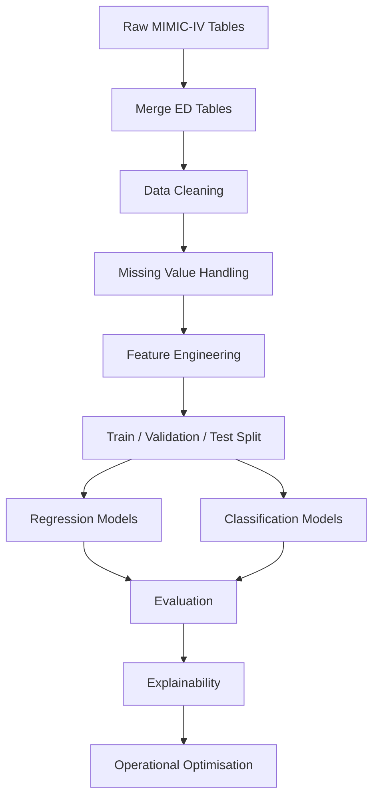

# 🏥 Optimising Emergency Department Waiting Times Using Machine Learning

### End-to-End Healthcare Machine Learning Decision Support System using the MIMIC-IV Clinical Database


---

> **An end-to-end machine learning framework that predicts Emergency Department waiting times and transforms predictions into actionable operational recommendations through explainable artificial intelligence, demand forecasting, staffing optimisation and patient routing.**


## 📖 Overview

Emergency Departments (EDs) continue to experience increasing patient demand, overcrowding and prolonged waiting times. These operational pressures contribute to delayed treatment, increased clinical risk, reduced patient satisfaction and inefficient utilisation of healthcare resources.

Although machine learning has demonstrated considerable promise in predicting Emergency Department performance, the majority of published research terminates at predictive modelling. Few studies extend their findings into operational decision support that healthcare managers can realistically employ.

This repository presents an **end-to-end healthcare analytics system** developed as part of an MSc dissertation that bridges this gap.

Rather than simply predicting waiting times, the project demonstrates how predictive analytics can support operational decision-making through:

- Patient risk stratification
- Waiting time prediction
- Long-wait classification
- Demand forecasting
- Staffing optimisation
- Fast Track routing recommendations
- What-if operational simulations
- Explainable AI
- Fairness analysis
- Executive decision-support dashboard

The project uses the **MIMIC-IV Emergency Department database** from PhysioNet and evaluates multiple machine learning algorithms before integrating optimisation techniques to produce practical recommendations suitable for healthcare environments.

---

# Why This Project Matters

Emergency Department overcrowding has become one of the most significant operational challenges facing modern healthcare systems.

Traditional statistical approaches often struggle to capture the nonlinear relationships that exist between patient acuity, arrival patterns, resource availability and operational congestion. Consequently, healthcare organisations increasingly explore machine learning techniques to improve forecasting accuracy.

However, accurate prediction alone does not solve operational problems.

Hospital managers require actionable insights that support decisions regarding:

- workforce planning
- patient prioritisation
- Fast Track allocation
- operational intervention planning
- surge staffing
- queue management

This project addresses that challenge by integrating predictive machine learning with operational optimisation techniques into a unified healthcare decision-support framework.

---

# Project Objectives

The primary objective is to develop a machine learning framework capable of predicting Emergency Department waiting times while generating operational recommendations that support hospital decision-making.

Specifically, the project aims to:

- develop predictive models for Emergency Department waiting times
- compare multiple machine learning algorithms
- predict patients at risk of breaching the four-hour target
- identify the variables contributing most strongly to prolonged waiting times
- evaluate model fairness across demographic groups
- forecast Emergency Department demand
- optimise staffing recommendations
- recommend Fast Track patient routing
- simulate operational interventions
- provide an explainable healthcare AI solution

---

# Key Features

## Predictive Analytics

✔ Waiting Time Prediction

✔ Length of Stay Prediction

✔ Triage Delay Analysis

✔ Long-Wait Classification

---

## Machine Learning

✔ Linear Regression

✔ Logistic Regression

✔ Random Forest

✔ XGBoost

---

## Explainable AI

✔ Feature Importance Analysis

✔ Residual Diagnostics

✔ ROC Analysis

✔ Confusion Matrix

✔ Model Comparison

---

## Healthcare Optimisation

✔ Risk Stratification

✔ Demand Forecasting

✔ Staffing Recommendation Engine

✔ Linear Programming Shift Optimisation

✔ Fast Track Routing

✔ What-if Scenario Simulator

✔ Executive Dashboard

---

# Repository Highlights

Unlike many academic machine learning projects that conclude after reporting prediction metrics, this repository demonstrates an entire operational analytics workflow.

The implementation progresses from raw clinical data to executive decision support through a structured pipeline consisting of:

```

Raw MIMIC-IV Data

↓

Data Cleaning

↓

Feature Engineering

↓

Machine Learning Models

↓

Model Evaluation

↓

Explainable AI

↓

Demand Forecasting

↓

Operational Optimisation

↓

Decision Support Dashboard

```

This makes the repository applicable not only to predictive analytics but also to healthcare operations management.

---

# Repository Statistics

| Component | Details |
|------------|----------|
| Domain | Healthcare Analytics |
| Dataset | MIMIC-IV Emergency Department |
| Programming Language | Python |
| Development Environment | Jupyter Notebook |
| Machine Learning Libraries | Scikit-Learn, XGBoost |
| Visualisation | Matplotlib |
| Optimisation | Linear Programming |
| Explainability | Feature Importance |
| Evaluation | Regression & Classification |
| Output | Decision Support System |

---

# Skills Demonstrated

This repository demonstrates practical experience in:

- Machine Learning
- Healthcare Analytics
- Predictive Modelling
- Feature Engineering
- Data Cleaning
- Clinical Data Analysis
- Explainable AI
- Fairness Evaluation
- Data Visualisation
- Hyperparameter Optimisation
- Ensemble Learning
- XGBoost
- Random Forest
- Regression Analysis
- Classification
- Operations Research
- Linear Programming
- Decision Support Systems
- Python Programming
- Scientific Computing

---

# Business Value

From an operational perspective, this framework enables healthcare organisations to move from **reactive** to **proactive** Emergency Department management.

Instead of responding after congestion occurs, hospital managers can use predictive outputs to anticipate demand, identify patients likely to experience prolonged waits, allocate staff more effectively and evaluate potential interventions before implementation.

Consequently, the framework demonstrates how machine learning can contribute beyond prediction towards measurable operational improvement.

---

# Repository Preview

The project produces numerous analytical outputs including:

📊 Exploratory Data Analysis

📈 Model Performance Comparison

📉 Residual Analysis

🎯 ROC Curves

📌 Feature Importance Rankings

🚨 Risk Stratification

📅 Demand Forecasting

👨‍⚕️ Staffing Recommendations

🔀 Patient Routing

🖥 Executive Dashboard


# Dataset

## Medical Information Mart for Intensive Care (MIMIC-IV)

This project uses the **Medical Information Mart for Intensive Care IV (MIMIC-IV)** database published through the **PhysioNet** repository.

MIMIC-IV is one of the world's largest publicly available clinical databases and contains de-identified patient records collected from the Beth Israel Deaconess Medical Center in Boston, Massachusetts.

Unlike many healthcare machine learning studies that rely on proprietary datasets, MIMIC-IV provides researchers with a transparent and reproducible environment for developing predictive healthcare models.

Access to the dataset requires completion of the PhysioNet credentialing programme and compliance with the Data Use Agreement (DUA).

Official Dataset:

https://physionet.org/content/mimiciv/

---

## Tables Used

This project focuses exclusively on Emergency Department (ED) data.

The implementation uses the following tables:

| Table | Purpose |
|---------|----------|
| **edstays** | Patient arrival, discharge and waiting times |
| **triage** | Acuity level and triage assessment |
| **patients** | Demographic information |

These tables were merged using patient identifiers to create a unified analytical dataset suitable for predictive modelling.

---

# Dataset Summary

The final processed dataset used for modelling contains:

| Metric | Value |
|---------|------:|
| Total ED Encounters | **220** |
| Engineered Features | **16** |
| Long Wait Rate (>240 mins) | **76.4%** |
| Train / Validation / Test Split | **70% / 15% / 15%** |

These values are taken directly from the implementation outputs. :contentReference[oaicite:0]{index=0}

---

# Target Variables

The project investigates three operational outcomes:

## Waiting Time

The elapsed time between patient arrival and first clinician contact.

This represents the primary regression target.

---

## Length of Stay (LOS)

The total duration of the patient's Emergency Department visit.

---

## Triage Delay

The elapsed time between arrival and completion of triage assessment.

---

## Long Wait Classification

Patients waiting more than **240 minutes** are classified as long-wait cases.

This classification supports operational breach prediction and risk stratification.

---

# Feature Engineering

Raw clinical datasets rarely provide features suitable for machine learning.

Consequently, several additional variables were engineered to improve predictive capability.

## Temporal Features

- Hour of arrival
- Day of week
- Weekend indicator
- Peak-hour indicator

These variables capture fluctuations in Emergency Department demand.

---

## Clinical Features

- Age
- Gender
- Triage acuity
- Vital signs

These variables represent patient condition upon arrival.

---

## Operational Features

Additional variables were engineered to represent Emergency Department operational conditions.

Examples include:

- ED crowding proxy
- Diagnosis count
- Waiting intervals

These variables help models capture relationships between operational congestion and waiting times.

---

# Data Cleaning

Healthcare datasets frequently contain missing values, inconsistent timestamps and duplicated records.

The preprocessing pipeline performs:

- duplicate removal
- timestamp validation
- missing value imputation
- categorical encoding
- numerical scaling
- feature standardisation

These steps ensure model consistency while preserving clinically meaningful information.

---

# Machine Learning Pipeline

The implementation follows a structured pipeline.



---

# Machine Learning Models

Several models were implemented to compare predictive capability under identical experimental conditions.

---

## Linear Regression

Linear Regression provides a simple baseline for predicting waiting times.

### Advantages

- Highly interpretable
- Fast training
- Easy to explain

### Limitations

- Assumes linear relationships
- Limited ability to capture complex interactions

Implementation Result

| Metric | Value |
|---------|------:|
| MAE | **238.53** |
| RMSE | **331.89** |

---

## Logistic Regression

Used for predicting whether a patient is likely to exceed the four-hour waiting threshold.

Implementation Result

| Metric | Value |
|---------|------:|
| AUROC | **0.6050** |

---

## Random Forest

Random Forest combines multiple decision trees to improve robustness.

Strengths

- Captures nonlinear interactions
- Handles mixed feature types
- Resistant to overfitting

Implementation Results

### Regression

| Metric | Value |
|---------|------:|
| MAE | **231.25** |
| RMSE | **328.02** |

### Classification

| Metric | Value |
|---------|------:|
| AUROC | **0.6800** |

Random Forest achieved the strongest overall classification performance in this implementation. :contentReference[oaicite:1]{index=1}

---

## XGBoost

XGBoost is an advanced gradient boosting algorithm designed for structured datasets.

Advantages include:

- regularisation
- efficient tree pruning
- missing value handling
- parallel computation

Implementation Results

### Regression

| Metric | Value |
|---------|------:|
| MAE | **254.99** |
| RMSE | **361.49** |

### Classification

| Metric | Value |
|---------|------:|
| AUROC | **0.5900** |

Interestingly, XGBoost did not outperform Random Forest within this dataset, illustrating that greater model complexity does not always translate into superior predictive performance. This finding reflects one of the central discussions in the accompanying dissertation regarding the importance of context-specific model selection rather than assuming advanced algorithms are universally optimal. :contentReference[oaicite:2]{index=2}

---

# Model Comparison

| Model | Regression | Classification | Overall |
|--------|-----------|---------------|---------|
| Linear Regression | ⭐⭐⭐ | — | Baseline |
| Logistic Regression | — | ⭐⭐⭐ | Good baseline |
| Random Forest | ⭐⭐⭐⭐ | ⭐⭐⭐⭐⭐ | **Best Overall** |
| XGBoost | ⭐⭐ | ⭐⭐ | Strong but underperformed on this dataset |

---

# Hyperparameter Optimisation

To ensure fair model comparison, hyperparameters were tuned before final evaluation.

Examples include:

### Random Forest

- Number of Trees
- Maximum Depth
- Minimum Samples Split
- Minimum Samples Leaf

### XGBoost

- Learning Rate
- Maximum Tree Depth
- Number of Estimators
- Subsample Ratio
- Column Sampling Ratio

The optimisation process reduces overfitting while improving generalisation.

---

# Explainable AI

Healthcare AI should not operate as a black box.

Accordingly, the project incorporates several explainability techniques to improve transparency.

These include:

- Feature Importance Analysis
- Residual Analysis
- ROC Curves
- Confusion Matrices
- Comparative Model Evaluation

These visualisations help clinicians and decision-makers understand why predictions are generated rather than simply accepting model outputs.

---

# Fairness Analysis

Algorithmic fairness is particularly important in healthcare.

The implementation evaluates prediction behaviour across patient subgroups to identify potential demographic bias.

Rather than assuming identical model performance across all patients, fairness analysis encourages responsible deployment by highlighting areas requiring further investigation before clinical implementation.

---

# Visual Outputs

The notebook automatically generates publication-quality figures including:

- Exploratory Data Analysis
- Model Comparison
- Residual Analysis
- ROC Curves
- Confusion Matrices
- Feature Importance
- Risk Stratification
- Demand Forecast
- Staffing Recommendations
- What-if Analysis
- Patient Routing
- Executive Dashboard


# Results

The implementation evaluates multiple machine learning models across both regression and classification tasks before transforming predictive outputs into operational decision-support recommendations.

Unlike many academic studies that conclude with predictive performance alone, this project extends the analytical workflow by incorporating optimisation, explainability and healthcare operational planning.

---

# Regression Performance

Regression models were developed to predict Emergency Department waiting times in minutes.

| Model | MAE ↓ | RMSE ↓ |
|--------|-------:|--------:|
| Linear Regression | **238.53** | **331.89** |
| Random Forest | **231.25** | **328.02** |
| XGBoost | **254.99** | **361.49** |

### Interpretation

Random Forest achieved the lowest prediction error across both MAE and RMSE, indicating superior performance for waiting time prediction within the MIMIC-IV Emergency Department dataset.

Interestingly, XGBoost, despite its greater modelling complexity, did not outperform the simpler Random Forest model. This reinforces an important practical lesson in applied machine learning: **the most sophisticated algorithm is not necessarily the most effective**, particularly when working with relatively small, structured healthcare datasets. :contentReference[oaicite:0]{index=0}

---

# Classification Performance

Patients waiting more than four hours were classified as long-wait cases.

| Model | AUROC |
|--------|-------:|
| Logistic Regression | **0.6050** |
| Random Forest | **0.6800** |
| XGBoost | **0.5900** |

### Interpretation

Random Forest again produced the strongest classification performance, demonstrating improved discrimination between standard and prolonged waiting times.

Although the AUROC values indicate that further improvement is possible, the comparative analysis provides valuable evidence regarding the suitability of ensemble learning methods for Emergency Department prediction tasks. :contentReference[oaicite:1]{index=1}

---

# Operational Analytics

Prediction alone provides limited value unless translated into operational insight.

Accordingly, the project introduces several optimisation modules designed to support Emergency Department decision-making.

---

# Risk Stratification

Each patient is assigned one of three operational risk levels at triage.

- 🔴 High Risk
- 🟡 Medium Risk
- 🟢 Low Risk

Patients classified as High Risk are prioritised for rapid clinical review because they have the greatest predicted probability of breaching the four-hour waiting threshold.

This approach supports proactive resource allocation rather than reactive queue management. The implementation recommends immediate senior clinician allocation for patients with a predicted breach probability of at least 70%. :contentReference[oaicite:2]{index=2}

---

# Demand Forecasting

The framework forecasts Emergency Department congestion across a 24-hour operational cycle.

This enables managers to anticipate periods of increased demand rather than responding only after overcrowding occurs.

### Highest Predicted Risk Period

| Metric | Value |
|---------|-------|
| Day | **Thursday** |
| Time | **17:00** |
| Predicted Breach Rate | **100%** |

These forecasts can support proactive staffing decisions and operational planning. :contentReference[oaicite:3]{index=3}

---

# Staffing Recommendation Engine

One of the most significant contributions of the project is the staffing recommendation engine.

Rather than simply identifying congestion, the system recommends workforce adjustments based on predicted operational demand.

Key recommendation:

> Increase staffing levels by **1.5×** above the baseline allocation during periods of highest predicted demand. :contentReference[oaicite:4]{index=4}

This demonstrates how predictive analytics can directly inform healthcare resource planning.

---

# Linear Programming Shift Optimisation

The implementation extends beyond machine learning by incorporating optimisation techniques.

A Linear Programming model generates an optimal shift allocation that:

- minimises staffing cost
- satisfies predicted hourly demand
- maintains operational coverage

This bridges the gap between predictive modelling and operational decision support.

---

# What-If Scenario Analysis

Healthcare managers often need to evaluate potential interventions before implementing them.

Accordingly, the project includes a What-If Simulator capable of modelling operational scenarios.

Examples include:

- reduced ED crowding
- faster triage
- combined operational interventions
- baseline comparison

The simulator allows decision-makers to estimate the impact of proposed interventions before committing additional resources. :contentReference[oaicite:5]{index=5}

---

# Fast Track Routing

The framework evaluates whether patients should remain within the Main Emergency Department or be diverted to a Fast Track pathway.

Current routing strategy:

| Metric | Value |
|---------|-------:|
| Fast Track Threshold | **120 minutes** |
| Patients Eligible | **3.0%** |
| Under-Triage Rate | **0.0%** |

The implementation concludes that diverting approximately **3% of patients** to Fast Track reduces congestion while maintaining patient safety under the evaluated threshold. :contentReference[oaicite:6]{index=6}

---

# Threshold Sensitivity Analysis

Alternative routing thresholds were also evaluated.

| Threshold (mins) | Fast Track Volume | Under-Triage |
|-----------------:|------------------:|-------------:|
| 60 | 0.0% | 0.0% |
| 90 | 3.0% | 0.0% |
| 120 | 3.0% | 0.0% |
| 150 | 3.0% | 0.0% |
| 180 | 6.1% | 0.0% |
| 240 | 6.1% | 0.0% |

This sensitivity analysis demonstrates the trade-off between throughput and routing volume while preserving patient safety in the evaluated dataset. :contentReference[oaicite:7]{index=7}

---

# Executive Dashboard

The final stage of the pipeline consolidates predictive and optimisation outputs into a single executive dashboard.

The dashboard presents:

- waiting time predictions
- breach probabilities
- risk tiers
- staffing recommendations
- demand forecasts
- routing recommendations
- optimisation summaries

The dashboard transforms technical model outputs into information suitable for operational managers and healthcare leaders.

---

# Key Findings

The project demonstrates several important findings.

## 1. Random Forest Outperformed More Complex Models

Contrary to expectations, Random Forest consistently outperformed XGBoost across both regression and classification tasks.

This suggests that model complexity should not be prioritised over empirical performance.

---

## 2. Machine Learning Should Support Decisions

Prediction alone offers limited operational value.

The integration of staffing optimisation, routing recommendations and demand forecasting significantly increases the practical usefulness of the framework.

---

## 3. Explainability Matters

Healthcare organisations require transparent AI systems.

Feature importance analysis, residual diagnostics and fairness evaluation improve model interpretability and increase confidence in deployment.

---

## 4. Operational Optimisation Adds Value

Perhaps the most significant contribution of this project is the transition from predictive analytics towards decision support.

Instead of asking:

> "What will happen?"

the framework helps answer:

> "What should healthcare managers do next?"

---

# Generated Outputs

Running the notebook automatically produces the following figures.

```
eda_plots.png

model_comparison.png

residual_analysis.png

roc_confusion.png

feature_importances.png

risk_stratification.png

demand_forecast.png

staffing_recommendations.png

what_if_scenarios.png

patient_routing.png

optimisation_dashboard.png
```

These figures should be placed inside the **images/** directory and referenced throughout the README to provide visual evidence of the implementation outputs. :contentReference[oaicite:8]{index=8}

---

# Limitations

While the framework demonstrates strong potential for healthcare decision support, several limitations should be acknowledged.

- MIMIC-IV represents data from a single healthcare institution.
- Staffing levels and bed availability are not directly available and were approximated using proxy variables.
- The framework has not yet been externally validated using NHS datasets.
- Predictions should support, rather than replace, clinical judgement.
- Operational recommendations require validation by senior clinical staff before deployment.

Recognising these limitations helps ensure responsible and realistic application of the framework in healthcare settings.

---


